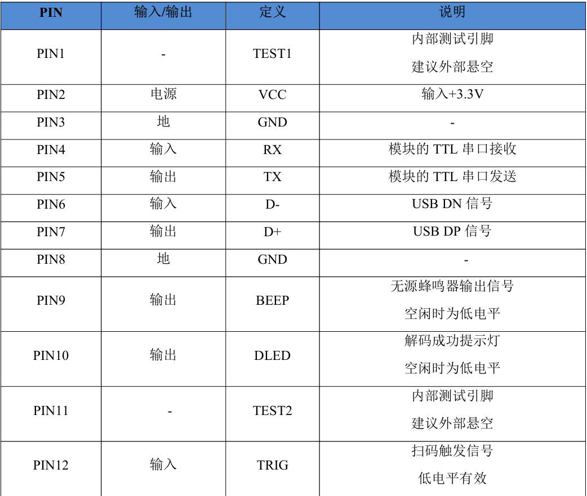
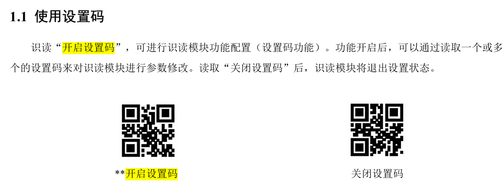
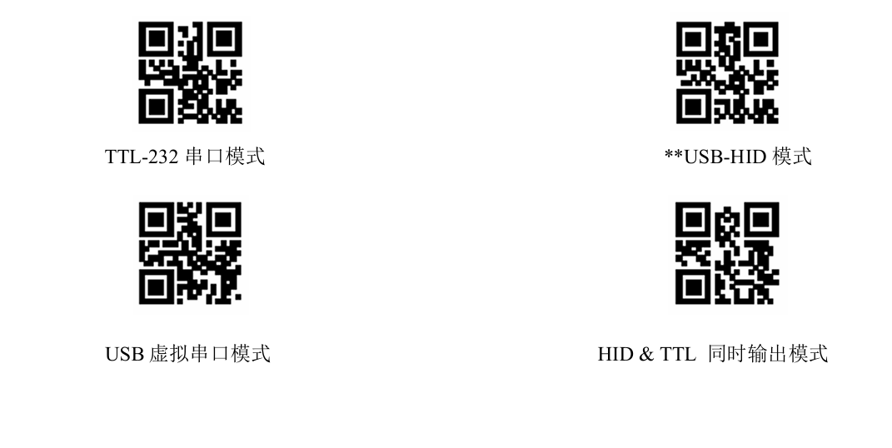
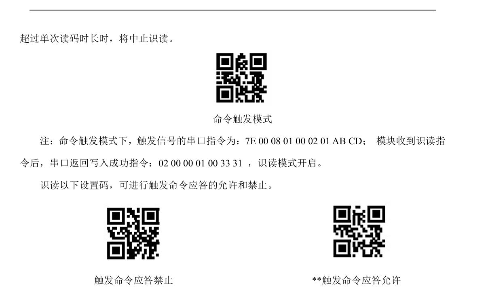
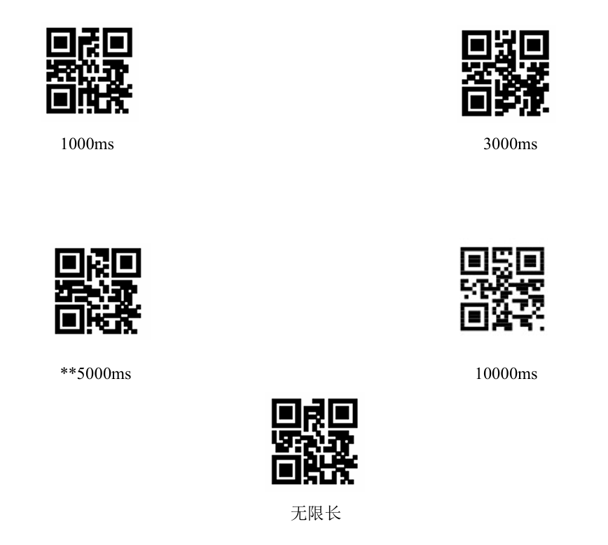
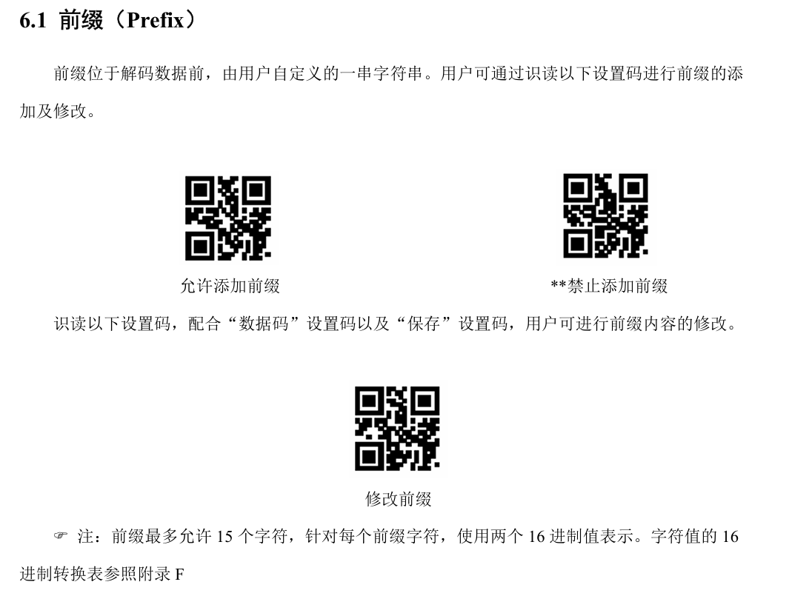
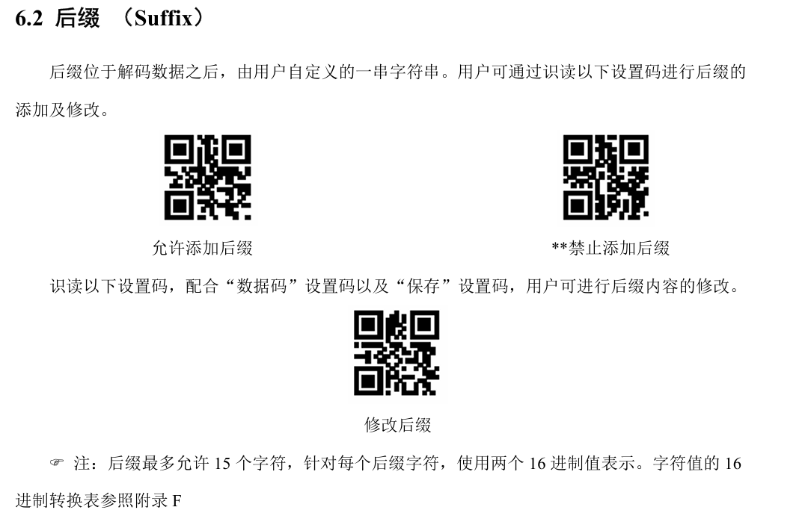
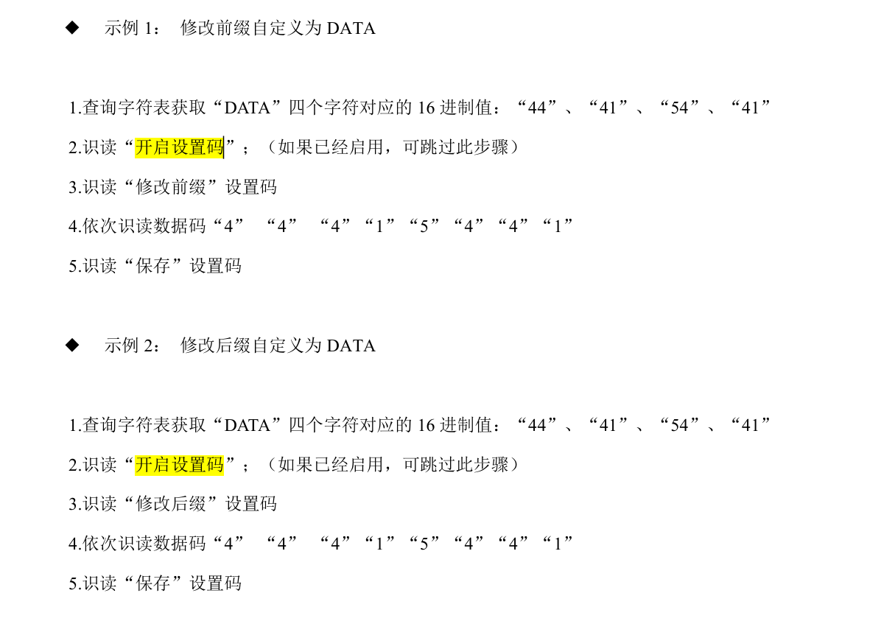
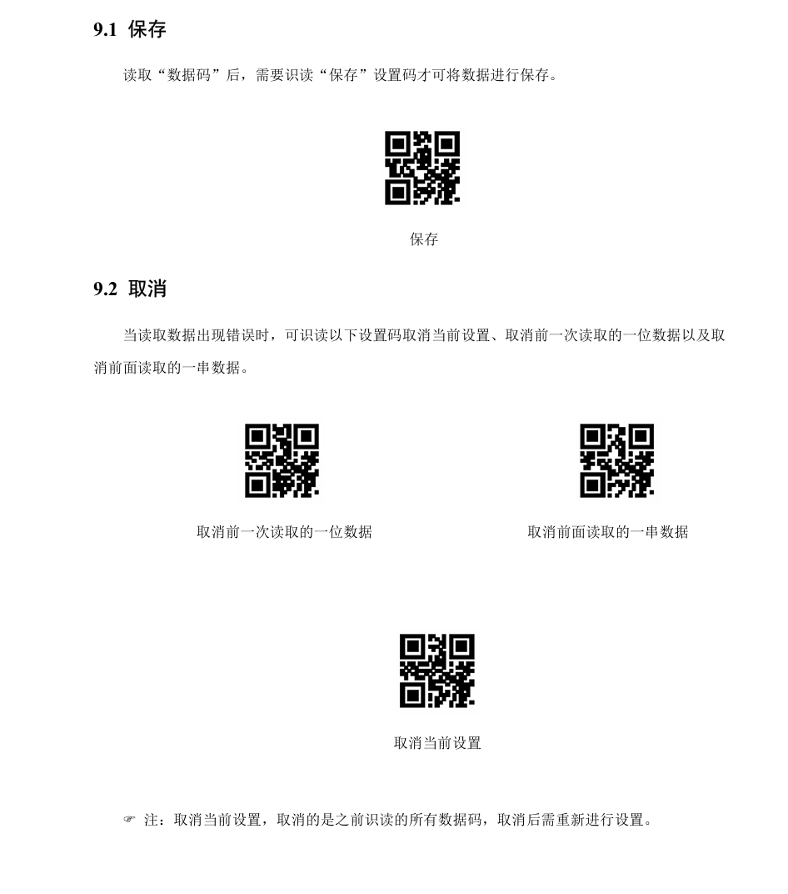

# XM1506扫码模块使用

## 1.购买模块

[选择裸模组+配件](https://item.taobao.com/item.htm?_u=920g895vf98914&id=722022510737&skuId=5024710705954&spm=a1z09.2.0.0.3cf62e8dYdbZJi "淘宝店主页")
购买到扫码模块，转接板，蜂鸣器


## 2.PCB打样与焊接

此步骤可以省略，只是为了方便接线。在嘉立创下单助手中下单本文件所在目录中的.zip文件，打样出连接转接板需要的PCB，并按照丝印将排针与蜂鸣器焊于其上，然后与转接板相连接


## 3.扫码模块的配置

- 默认的波特率为9600，可根据个人喜好查阅用户手册进行改变
- 设置码
 
设置码默认状态下为开启状态，可以直接设别二维码进行模块的功能设置，只有此状态下，识别设置码才会有效果
- 初始默认情况下开启扫码为将pin12和pin8接在一起
### 1.用USB_TTL模块将扫码模块连接至电脑串口，进行初步配置
1. 
 
扫码模块上电后默认通讯方式为USB-HID模式，我们需要将其改变为TTL-232串口模式，扫描这个设置码即可
2. 
 
 依此扫描命令触发模式和触发命令应答禁止，即使用单片机发送指令串口指令触发扫码动作，并禁用触发成功后的返回指令，只返回扫到的东西
 触发指令为发送 7E 00 08 01 00 02 01 AB CD
 当扫描命令触发模式码后，触发扫码的动作即为发送此指令，可以使用usb-ttl通过串口助手发送指令触发余下扫码动作
3. 
 
 可扫描其中想要的读码时长来设置每次读取二维码的时间，建议为5000ms或10000ms
4. 

 设置返回扫到的内容的==包头包尾==（前缀和后缀），方便单片机进行解析与读取
 - 
 -------------------------------
 -  
 -------------------------------
 -  
 -------------------------------
 -  
 -------------------------------
 以添加后缀为例：
 1.获得想添加的后缀的字符的16进制，以本实例代码为例，后缀为#$，那么就需要获得23 24，就需要依次扫描 2 3 2 4的数据码，数据码请查阅手册
 2.扫描允许添加后缀，再扫描修改后缀
 3.依次扫描 2 3 2 4的数据码
 4.扫描“保存”设置码,至此完成了后缀的添加，前缀同理

### 2.进行32单片机的配置

1. 将uart.c和uart.h中的代码移植到你的需要地方
2. 调用UART5_Start_Scan()函数，当扫描到东西后，便会返回数据存在UART5_RX_BUF[]数组当中，直接读取即可


### 3.具体在工程当中的使用  
- 在主函数中的调用
```c

#include "uart.h"
void main()
{
    UART5_Init();
    UART5_Start_Scan();//发送扫码指令
    if(Serial5_GetRxFlag()==1)//收到了模块发给单片机的东西
    {
       /*
       可以将收到的内容直接用SendString发给树莓派
       用UART5_PraseCode()函数解析出code1和code2发给串口屏
       等等操作
       */
    }


}
```

--------------------------------------


> Created by ==*FClSc*==  NPUGC
>2024/12/9

> 模块及用户产品手册来源：深圳市芯码电子有限公司